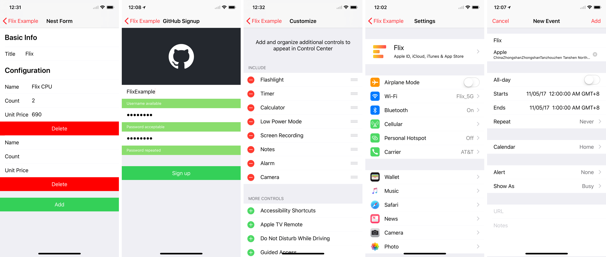
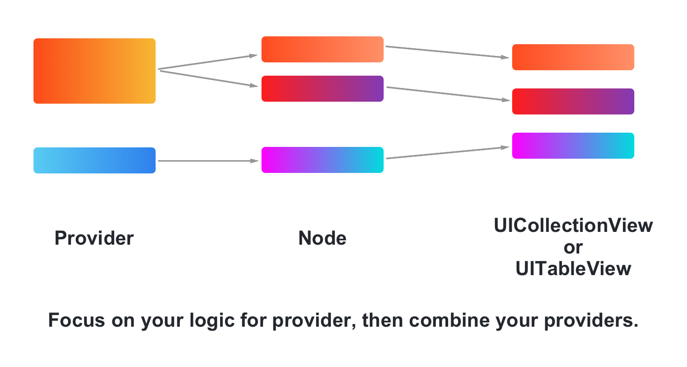
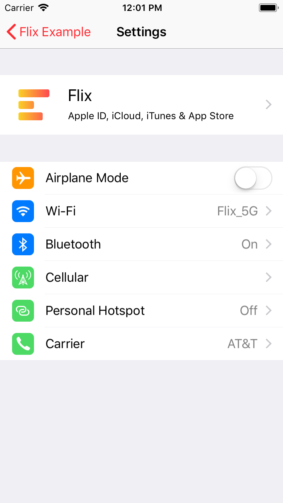
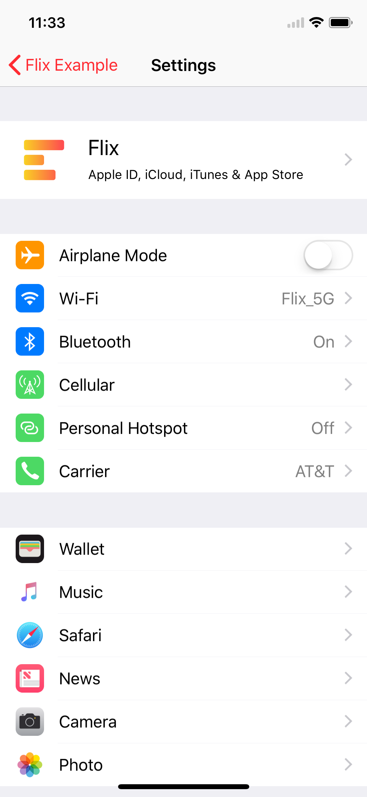

[](https://travis-ci.org/DianQK/Flix)
[](https://cocoapods.org/pods/Flix)
[](https://github.com/Carthage/Carthage)

Flix 是一个使用 `UITableView` 或 `UICollectionView` 创建（类）表单的解决方案。
使用 Flix 你可以非常轻松地构建出各种复杂的列表视图，并处理其中复杂的交互逻辑。

## 特性

- [x] 支持使 Cell 不被复用
- [x] 支持创建列表项时，使用 Cell 复用特性
- [x] 支持创建嵌套表单
- [x] 支持移动、添加、删除
- [x] 支持使用 Storyboard 构建
- [x] 完整的示例项目
- [x] 兼容 `UITableView` 和 `UICollectionView`

Flx 关注构建 `UICollectionView` / `UITableView` 的 Cell，它不限制视图的布局和交互的逻辑。
所以你可以很轻松的使用 Flix 创建定制的表单页面。

## 预览



## 使用要求

- Xcode 9.0+
- Swift 4.0+
- RxSwift 4.0+
- RxDataSources 3.0+

## 安装

### CocoaPods

```ruby
pod 'Flix', '~> 1.2'
```

### Carthage

```
github "DianQK/Flix" ~> 1.2
```

## 原理



每一个 Provider 会生成若干个 Cell（Node），然后将这些 Cell 按照 Provider 的顺序组合成一个完整的列表。

## 指导 - 一个简单的设置页面

创建一个设置页时，我们希望每一个 Cell 都不会被复用，就好像在使用 Static `UITableView`。

比如在 iOS 11 上 Settings 中的个人信息 Cell，创建一个 `UniqueCustomTableViewProvider`，配置好样式并添加好相应的视图：

<table>
  <tr>
    <td width="70%"><div class="highlight highlight-source-swift"><pre>
let profileProvider = UniqueCustomTableViewProvider()
profileProvider.itemHeight = { _ in return 80 }
profileProvider.accessoryType = .disclosureIndicator

let avatarImageView = UIImageView(
    image: #imageLiteral(resourceName: "Flix Icon")
)
profileProvider.contentView.addSubview(avatarImageView)

let nameLabel = UILabel()
nameLabel.text = "Flix"
profileProvider.contentView.addSubview(nameLabel)

let subTitleLabel = UILabel()
subTitleLabel.text = "Apple ID, iCloud, iTunes & App Store"
profileProvider.contentView.addSubview(subTitleLabel)

self.tableView.flix.build([profileProvider])
</pre></div></td>
    <th width="30%"></th>
  </tr>
</table>

考虑到 `profileProvider` 有可能被复用，为 `profileProvider` 创建一个类管理所有的视图是更好的方案。

你可以直接继承 `UniqueCustomTableViewProvider`：

```swift
class ProfileProvider: UniqueCustomTableViewProvider {

    let avatarImageView = UIImageView()
    let nameLabel = UILabel()
    let subTitleLabel = UILabel()

    init(avatar: UIImage, name: String) {
        super.init()

        self.itemHeight = { _ in return 80 }
        self.accessoryType = .disclosureIndicator

        avatarImageView.image = avatar
        self.contentView.addSubview(avatarImageView)

        nameLabel.text = name
        self.contentView.addSubview(nameLabel)

        subTitleLabel.text = "Apple ID, iCloud, iTunes & App Store"
        self.contentView.addSubview(subTitleLabel)
    }

}
```

或者直接实现协议 `UniqueAnimatableTableViewProvider`：

```swift
class ProfileProvider: UniqueAnimatableTableViewProvider {

    let avatarImageView = UIImageView()
    let nameLabel = UILabel()
    let subTitleLabel = UILabel()

    init(avatar: UIImage, name: String) {
        avatarImageView.image = avatar
        nameLabel.text = name
        subTitleLabel.text = "Apple ID, iCloud, iTunes & App Store"
    }

    func onCreate(_ tableView: UITableView, cell: UITableViewCell, indexPath: IndexPath) {
        cell.accessoryType = .disclosureIndicator
        cell.contentView.addSubview(avatarImageView)
        cell.contentView.addSubview(nameLabel)
        cell.contentView.addSubview(subTitleLabel)
    }

    func tableView(_ tableView: UITableView, heightForRowAt indexPath: IndexPath, value: ProfileProvider) -> CGFloat? {
        return 80
    }

}
```

看起来还不够，实际的 Settings 中用户信息是被放在一个单独的 Section 中的。我们可以为这个 `profileProvider` 包一层 `SectionProvider`：

<table>
  <tr>
    <td width="70%"><div class="highlight highlight-source-swift"><pre>
let profileSectionProvider = SpacingSectionProvider(
    providers: [profileProvider],
    headerHeight: 35,
    footerHeight: 0
)
self.tableView.flix.build([profileSectionProvider])</pre></div></td>
    <th width="30%"></th>
  </tr>
</table>

最后我们还可以创建更多的 Provider 构建一个更完整的 Settings 列表：

<table>
  <tr>
    <td width="70%"><div class="highlight highlight-source-swift"><pre>
let profileProvider = ProfileProvider(
    avatar: #imageLiteral(resourceName: "Flix Icon"),
    name: "Flix")
let profileSectionProvider = SpacingSectionProvider(
    providers: [profileProvider],
    headerHeight: 35,
    footerHeight: 0)
let airplaneModeProvider = SwitchTableViewCellProvider(
    title: "Airplane Mode",
    icon: #imageLiteral(resourceName: "Airplane"),
    isOn: false)
let wifiProvider = DescriptionTableViewCellProvider(
    title: "Wi-Fi",
    icon: #imageLiteral(resourceName: "Wifi"),
    description: "Flix_5G")
let bluetoothProvider = DescriptionTableViewCellProvider(
    title: "Bluetooth",
    icon: #imageLiteral(resourceName: "Bluetooth"),
    description: "On")
let cellularProvider = DescriptionTableViewCellProvider(
    title: "Cellular",
    icon: #imageLiteral(resourceName: "Cellular"))
let hotspotProvider = DescriptionTableViewCellProvider(
    title: "Personal Hotspot",
    icon: #imageLiteral(resourceName: "Personal Hotspot"),
    description: "Off")
let carrierProvider = DescriptionTableViewCellProvider(
    title: "Carrier",
    icon: #imageLiteral(resourceName: "Carrier"),
    description: "AT&T")
let networkSectionProvider = SpacingSectionProvider(
    providers: [
        airplaneModeProvider,
        wifiProvider,
        bluetoothProvider,
        cellularProvider,
        hotspotProvider,
        carrierProvider
    ],
    headerHeight: 35,
    footerHeight: 0
)
self.tableView.flix.build(
    [profileSectionProvider, networkSectionProvider]
)
    </pre></div></td>
    <th width="30%"></th>
  </tr>
</table>

以上我们都使用 Provider 创建了单一的 Cell，Flix 还支持使用一个 Provider 创建多个 Cell：

<table>
  <tr>
    <td width="70%"><div class="highlight highlight-source-swift"><pre>
let appSectionProvider = SpacingSectionProvider(
    providers: [AppsProvider(apps: [
        App(icon: Wallet, title: "Wallet"),
        App(icon: iTunes, title: "iTunes"),
        App(icon: Music, title: "Music"),
        App(icon: Safari, title: "Safari"),
        App(icon: News, title: "News"),
        App(icon: Camera, title: "Camera"),
        App(icon: Photos), title: "Photo")
        ])],
    headerHeight: 35,
    footerHeight: 35
)
self.tableView.flix.build([
    profileSectionProvider,
    networkSectionProvider,
    appSectionProvider]
)
    </pre></div></td>
    <th width="30%"></th>
  </tr>
</table>

这样一来，我们就拥有了一个比较完整的设置页面。
实际上 Flix 支持更多构建列表视图的功能，你也可以轻松创建出带有各种联动效果的页面（比如示例中的仿照创建日历事件的 All Events，再比如完整拷贝 RxSwift Example 的 Github Signup 页面）。

## Contributing

1. Please fork this project
2. Implement new methods or changes。
3. Write appropriate docs and comments in the README.md
4. Submit a pull request.

## Contact

Raise an [Issue](https://github.com/DianQK/Flix/issues) or hit me up on Twitter [@Songxut](https://twitter.com/Songxut).

You can also join Telegram Group https://t.me/Flix_iOS.

## License

Flix is released under an MIT license. See LICENSE for more information.
